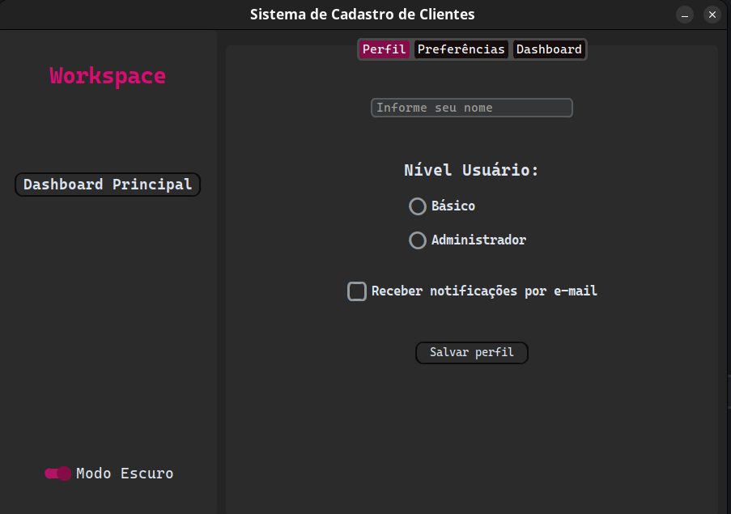

# 🖥️ Sistema de Cadastro de Clientes & Dashboard

Interface gráfica (GUI) moderna desenvolvida em Python com a biblioteca **CustomTkinter**. O projeto engloba cadastro de perfis, painel de preferências e visualização de dashboard.

